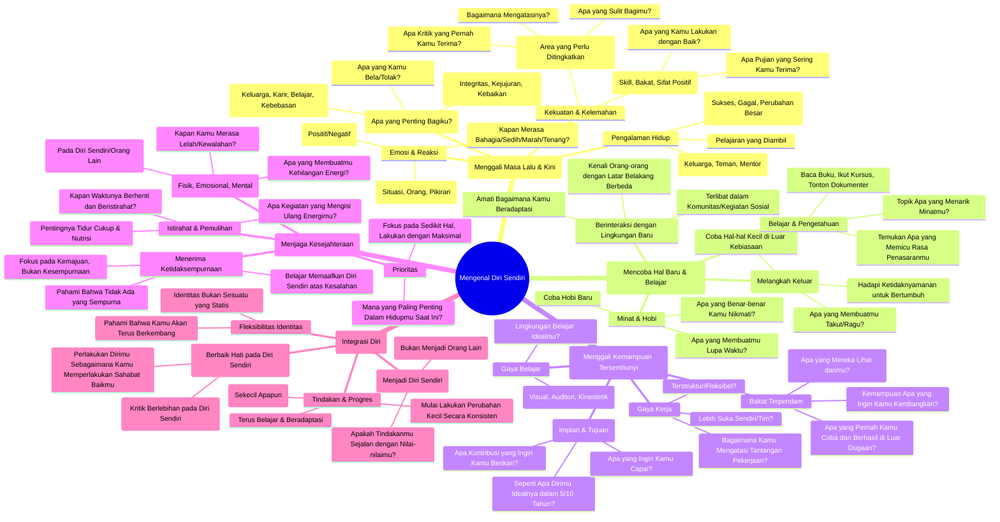

```mermaid
mindmap
  root((Mengenal Diri Sendiri))

    1. Refleksi Diri (Menggali Masa Lalu & Kini)
      Pengalaman Hidup
        Momen Kunci (Sukses, Gagal, Perubahan Besar)
        Hubungan Penting (Keluarga, Teman, Mentor)
        Pelajaran yang Diambil
      Emosi & Reaksi
        Kapan Merasa Bahagia/Sedih/Marah/Tenang?
        Apa Pemicunya? (Situasi, Orang, Pikiran)
        Bagaimana Responsmu Biasanya? (Positif/Negatif)
      Nilai-nilai Diri (Apa yang Penting Bagiku?)
        Prinsip Hidup (Integritas, Kejujuran, Kebaikan)
        Prioritas (Keluarga, Karir, Belajar, Kebebasan)
        Apa yang Kamu Bela/Tolak?
      Kekuatan & Kelemahan
        Kekuatan (Skill, Bakat, Sifat Positif)
          Apa yang Kamu Lakukan dengan Baik?
          Apa Pujian yang Sering Kamu Terima?
        Kelemahan (Area yang Perlu Ditingkatkan)
          Apa yang Sulit Bagimu?
          Apa Kritik yang Pernah Kamu Terima?
          Bagaimana Mengatasinya?

    2. Eksplorasi Diri (Mencoba Hal Baru & Belajar)
      Minat & Hobi
        Apa yang Benar-benar Kamu Nikmati?
        Apa yang Membuatmu Lupa Waktu?
        Coba Hobi Baru
      Zona Nyaman (Melangkah Keluar)
        Apa yang Membuatmu Takut/Ragu?
        Coba Hal-hal Kecil di Luar Kebiasaan
        Hadapi Ketidaknyamanan untuk Bertumbuh
      Belajar & Pengetahuan
        Topik Apa yang Menarik Minatmu?
        Baca Buku, Ikut Kursus, Tonton Dokumenter
        Temukan Apa yang Memicu Rasa Penasaranmu
      Berinteraksi dengan Lingkungan Baru
        Kenali Orang-orang dengan Latar Belakang Berbeda
        Terlibat dalam Komunitas/Kegiatan Sosial
        Amati Bagaimana Kamu Beradaptasi

    3. Memahami Potensi Diri (Menggali Kemampuan Tersembunyi)
      Bakat Terpendam
        Apa yang Pernah Kamu Coba dan Berhasil di Luar Dugaan?
        Kemampuan Apa yang Ingin Kamu Kembangkan?
        Minta Pendapat Orang Lain (Apa yang Mereka Lihat darimu?)
      Gaya Belajar
        Bagaimana Kamu Belajar Paling Efektif? (Visual, Auditori, Kinestetik)
        Lingkungan Belajar Idealmu?
      Gaya Kerja
        Lebih Suka Sendiri/Tim?
        Terstruktur/Fleksibel?
        Bagaimana Kamu Mengatasi Tantangan Pekerjaan?
      Visi Masa Depan (Impian & Tujuan)
        Seperti Apa Dirimu Idealnya dalam 5/10 Tahun?
        Apa yang Ingin Kamu Capai?
        Apa Kontribusi yang Ingin Kamu Berikan?

    4. Menetapkan Batasan Diri (Menjaga Kesejahteraan)
      Batasan Personal (Fisik, Emosional, Mental)
        Kapan Kamu Merasa Lelah/Kewalahan?
        Apa yang Membuatmu Kehilangan Energi?
        Belajar Mengatakan "Tidak" (Pada Diri Sendiri/Orang Lain)
      Prioritas
        Mana yang Paling Penting Dalam Hidupmu Saat Ini?
        Fokus pada Sedikit Hal, Lakukan dengan Maksimal
      Istirahat & Pemulihan
        Kapan Waktunya Berhenti dan Beristirahat?
        Apa Kegiatan yang Mengisi Ulang Energimu?
        Pentingnya Tidur Cukup & Nutrisi
      Menerima Ketidaksempurnaan
        Pahami Bahwa Tidak Ada yang Sempurna
        Belajar Memaafkan Diri Sendiri atas Kesalahan
        Fokus pada Kemajuan, Bukan Kesempurnaan

    5. Mengelola Identitas (Integrasi Diri)
      Autentisitas (Menjadi Diri Sendiri)
        Apakah Tindakanmu Sejalan dengan Nilai-nilaimu?
        Berani Tampil Apa Adanya (Bukan Menjadi Orang Lain)
      Fleksibilitas Identitas
        Pahami Bahwa Kamu Akan Terus Berkembang
        Identitas Bukan Sesuatu yang Statis
      Self-Compassion (Berbaik Hati pada Diri Sendiri)
        Perlakukan Dirimu Sebagaimana Kamu Memperlakukan Sahabat Baikmu
        Kurangi Self-Criticism (Kritik Berlebihan pada Diri Sendiri)
      Tindakan & Progres
        Mulai Lakukan Perubahan Kecil Secara Konsisten
        Rayakan Setiap Kemajuan (Sekecil Apapun)
        Terus Belajar & Beradaptasi
```
